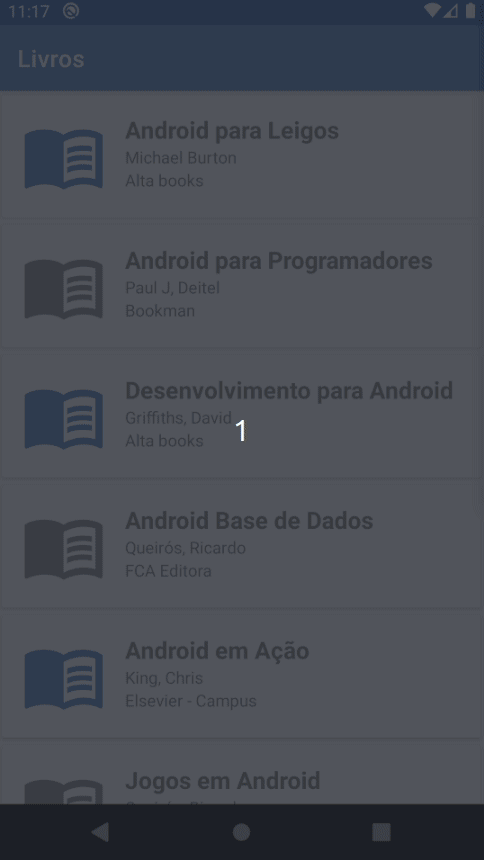

# Gerenciador de Livros

## 🚀 Tecnologias

Esse projeto foi desenvolvido em Java atráves do Android Studio.

## 💻 Projeto      

Este projeto é um gerenciador de livros, com ele é possível adicionar, editar e remover os livros da sua coleção.

## 🎥 Demonstração

  

